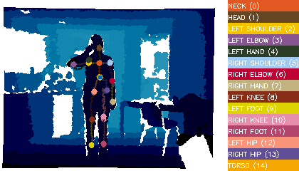

# Depth Pose Estimation And Action Recognition
> This project is a simple modification to https://github.com/ddxue/depth-pose-estimation project.

Train models to predict body parts or joints.

Action recognition program has not yet been complete.



## Usage example

If you want to train quickly with CAD-60 dataset, you could use the following command.

The parameter **--input-dir** is the location of npy file.
```sh
python main.py --dataset CAD-60 --input-dir data/input
```
If you want to predict the joints position with model trained by me, use this:
```sh
python main.py --dataset CAD-60 --input-dir data/input --load-model
```

For vscode users, you could just use **launch.json** as default debug parameter
```json
   "configurations": [{
            "name": "train with CAD-60 and rtw model",
            "type": "python",
            "request": "launch",
            "program": "${file}",
            "console": "integratedTerminal",
            "args": ["--dataset", "CAD-60", "--input-dir", "data/input"]
        },
        {
            "name": "load model to predict CAD-60",
            "type": "python",
            "request": "launch",
            "program": "${file}",
            "console": "integratedTerminal",
            "args": ["--dataset", "CAD-60", "--input-dir", "data/input", "--load-model"]
        }]        
```
## Development setup

Install all development dependencies 

```sh
pip install sklearn
pip install numpy
pip install pickle
pip install opencv-python
```

## Content of this project
```
DEPTH-POSE-ESTIMATION
│  .gitignore
│  contents.txt
│  header.png
│  main.py
│  README.md
│  
├─.vscode
│  │  launch.json
│  │  
│  └─.ropeproject
│          
├─data
│  ├─input
│  │      depth_images.npy
│  │      joints.npy
│  │      
│  └─output
│      ├─png
│      │      *.png
│      │      
│      └─preds
│              distances.txt
│              
└─model
        L0.pkl
        L1.pkl
        L10.pkl
        L11.pkl
        L12.pkl
        L13.pkl
        L14.pkl
        L2.pkl
        L3.pkl
        L4.pkl
        L5.pkl
        L6.pkl
        L7.pkl
        L8.pkl
        L9.pkl
        regressor0.pkl
        regressor1.pkl
        regressor10.pkl
        regressor11.pkl
        regressor12.pkl
        regressor13.pkl
        regressor14.pkl
        regressor2.pkl
        regressor3.pkl
        regressor4.pkl
        regressor5.pkl
        regressor6.pkl
        regressor7.pkl
        regressor8.pkl
        regressor9.pkl
        theta.pkl
```
**depth_images.npy** and **joints.npy** is the preprocessed dataset